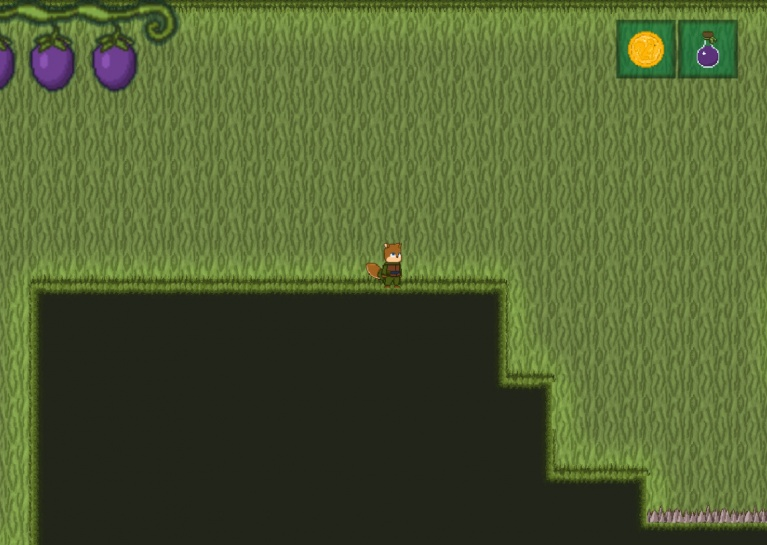
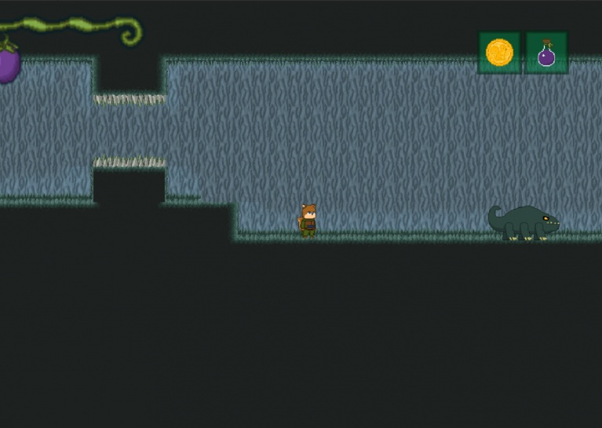
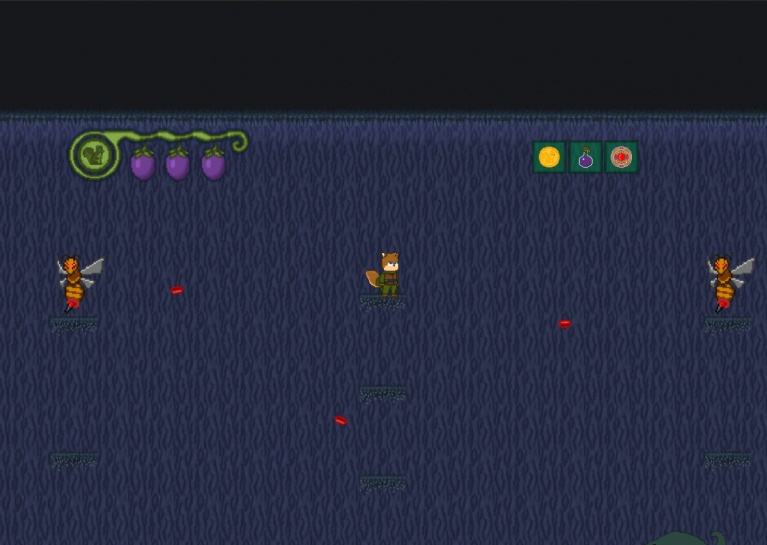

# Ike and the Sanctuary of Life

## Synopsis
*Ike and the Sanctuary of Life* is an engaging 2D platformer-shooter sidescroller where you control Ike, a squirrel, on a mission to save the sacred tree from corruption. Navigate through challenging environments, defeat enemies, and uncover the mystery behind the tree's corruption.

## Global Game Jam 2023
The game was developed during the Global Game Jam 2023. Click on the link below to access its page.

## Downloads
Available for Windows.

## Screenshots

  
  
  

## How to Play
- **Move**: Use WASD to move Ike.
- **Jump**: Press space to jump.
- **Shoot**: Use the left mouse button to shoot.

## Installation Instructions
1. Download the latest build from the link above.
2. Extract the ZIP file.
3. Run `GameJam2023.exe` to start playing.
